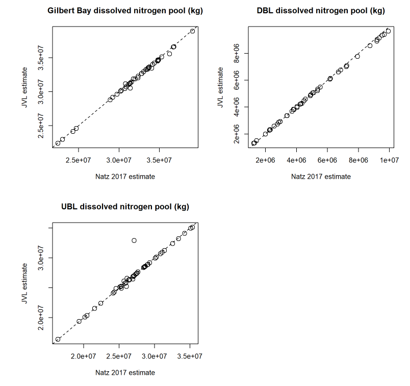

# Salt pools

## Introduction
This analysis applies the approach from Naftz [-@naftz_inputs_2017] to calculate Gilbert Bay deep brine layer (DBL) & upper brine layer (UBL) volumes and constituent masses to estimate salt masses within Gilbert Bay by brine layer. 
There are two main differences between this analysis and the Naftz approach. First, I incorporated all available data from all sites in Gilbert Bay in addition to the four monitoring 
locations used in Naftz [-@naftz_inputs_2017]. Second, I did not fill missing data by month and site with the previous observed value. Any month with no salinity results available 
for a brine layer will produce an NA result.

## General methods
1. Estimate monthly UBL and DBL volumes
2. Estimate monthly average brine layer salinities
3. Multiply volumes by salinities to estimate masses

Monthly UBL and DBL volumes were estimated from daily Gilbert Bay water surface elevation measurements via surface elevation to DBL elevation and DBL elevation to DBL volume relationships developed as presented in 
supplementary material 7 from Naftz [-@naftz_inputs_2017] and developed by Baskin [-@baskin_calculation_2005]. These relationships were based on observations from 2010-2014 spanning Gilbert Bay surface water elevations from about 1278-1279 m (~4193-4196 ft). 
DBL volumes are estimated for north and south DBL basins separately.  

? volume curves from Baskin USGS  

I estimated monthly average salinities in each brine layer by averaging all salinity samples collected within each brine layer. Samples were assigned to a brine layer by site location and depth.
DBL samples were defined as those occurring at sites 405356112205601 (south) or 410644112382601 (north) and with sampling depth >= 5 meters (see map, \@ref(fig:site-map)). 
UBL samples were defined as any sample in Gilbert Bay <= 2 meters sampling depth. 

Salt masses are estimated by multiplying monthly brine layer volumes by monthly average salinities (mass/volume). The north and south DBL basin masses were summed to simplify plots.  

## Validation
I validated this mass estimation method against the original Naftz [-@naftz_inputs_2017] estimates by comparing monthly values estimated for their target constituent (dissolved nitrogen) from both approaches. Overall, there is strong 
agreement between the two methods (Figures \@ref(fig:jvl-naftz-comp1) & \@ref(fig:jvl-naftz-comp2)).  

```{r, jvl-naftz-comp1, echo=F, fig.cap = "Scatter plot comparison of north and south DBL & UBL dissolved nitrogen masses between Naftz 2017 and JVL estimates.", out.width = "800px"}

```

```{r, jvl-naftz-comp2, echo=F, out.extra='style="border: none;"', fig.cap = "Time series comparison of north and south DBL & UBL dissolved nitrogen masses between Naftz 2017 and JVL estimates.", fig.width=8, fig.height=6}
knitr::include_url("images/jvn_naftz_dn_comp2.html")
```

## Code
### Calculate UBL & DBL volumes
```{r, ubl-dbl-vol}
gb_elev_vol=subset(elevation, site_no==10010000)
gb_elev_vol=within(gb_elev_vol, {
	elev_m=elev_ft/3.28084
	DBL_elev_N=-46.51008+1.03163*elev_m
	DBL_elev_N[DBL_elev_N<1269.43714800001]=1269.43714800001 #Setting minimum possible N DBL elevation at inflection point of formula
	DBL_elev_S=-104.967+1.07643*elev_m
	DBL_elev_S[DBL_elev_S<1270.92582600001]=1270.92582600001 #Setting minimum possible S DBL elevation at inflection point of formula
	DBL_vol_N_m3=59633174862208.5-93949911022.036*DBL_elev_N+37003662.2562751*DBL_elev_N^2
	DBL_vol_S_m3=120180569424473-189400877631.774*DBL_elev_S+74622375.23038100*DBL_elev_S^2
	DBL_vol_total_m3=DBL_vol_S_m3+DBL_vol_N_m3
	UBL_vol_m3=(137054926141519-216113402592.612*elev_m+85193657.0902014*elev_m^2)-DBL_vol_total_m3
	GB_vol_m3=137054926141519-216113402592.612*elev_m+85193657.0902014*elev_m^2
	DBL_vol_acreft=DBL_vol_total_m3*0.000810714
	UBL_vol_acreft=UBL_vol_m3*0.000810714
	GB_vol_acreft=GB_vol_m3*0.000810714
	year=lubridate::year(Date)
	month=lubridate::month(Date)
})

DBLn_vol_YrMo=aggregate(DBL_vol_N_m3~year+month,FUN='mean',gb_elev_vol)
DBLs_vol_YrMo=aggregate(DBL_vol_S_m3~year+month,FUN='mean',gb_elev_vol)
UBL_vol_YrMo=aggregate(UBL_vol_m3~year+month,FUN='mean',gb_elev_vol)
gb_vol_YrMo=merge(UBL_vol_YrMo,DBLn_vol_YrMo,by=c("year","month"))
gb_vol_YrMo=merge(gb_vol_YrMo,DBLs_vol_YrMo,by=c("year","month"))
```


### Create flat wq data
```{r, flat-data}
sal_flat=reshape2::melt(wq_data, id.vars=c("site_no", "Bay", "sample_dt", "sample_tm", "rel_depth", "Sampling_depth_m", "SiteType"),
							measure.vars=c("Salinity_gL"),
							na.rm=T)
sal_flat=subset(sal_flat, Bay=='Gilbert' & !is.na(sal_flat$rel_depth) & SiteType %in% c("Lake","Lake, DBL"))
```


### ID WQ samples as UBL or DBL representatives, convert g/L to mg/L
Defined DBL samples as those occurring at sites 405356112205601 or 410644112382601 and with sampling depth >= 5 meters (see map).  
Defined UBL samples as any sample in Gilbert Bay >= 2 meters sampling depth. 
```{r, id-dbl}
sal_flat=within(sal_flat, {
	bl=NA
	bl[site_no==405356112205601 & Sampling_depth_m >=5] = 'DBLs'
	bl[site_no==410644112382601 & Sampling_depth_m >=5] = 'DBLn'
	bl[Bay=='Gilbert' & Sampling_depth_m <=2] = 'UBL'
	variable=as.character(variable)
	value[variable=='Salinity_gL'] = value
	variable[variable=='Salinity_gL'] = 'Salinity_mgL'
	year=lubridate::year(sample_dt)
	month=lubridate::month(sample_dt)
})
```


### Calculate monthly means & SDs for UBL & DBL WQ parameters
```{r, mon-means}
mon_means=aggregate(value~year+month+variable+bl, sal_flat, FUN='mean', na.rm=T)
mon_means=reshape2::dcast(mon_means, year+month+variable~bl, value.var='value')
mon_means=dplyr::rename(mon_means, DBL_mean_s=DBLs, DBL_mean_n=DBLn, UBL_mean=UBL)
```

### Calculate masses
gb_pool_data=gb_pool_data[order(gb_pool_data$YrMo),]
```{r calc-mass}
gb_pool_data=merge(gb_vol_YrMo, mon_means)
gb_pool_data=within(gb_pool_data, {
	UBL_mass_kg=UBL_vol_m3*UBL_mean
	DBL_mass_kg=(DBL_mean_n*DBL_vol_N_m3 + DBL_mean_s*DBL_vol_S_m3)
	tot_mass_kg=DBL_mass_kg+UBL_mass_kg
	YrMo=as.Date(paste0(year,"-",month,"-01"),format='%Y-%m-%d')
})
```

### Salt mass plot
```{r, salt-mass-plot}
salt_mass_plot=plot_ly(data=gb_pool_data) %>%
	add_trace(type='scatter', y=~tot_mass_kg, x=~YrMo, mode = 'markers', name='Total', marker = list(color = cols[[5]][[1]],size = 10,line = list(color = cols[[5]][[2]],width = 2))) %>% #, line = list(color = cols[[5]][[2]],width = 2)) %>%
	add_trace(type='scatter', y=~DBL_mass_kg, x=~YrMo, mode = 'markers', name='Deep brine layer', marker = list(symbol=2, color = cols[[2]][[1]],size = 10,line = list(color = cols[[2]][[2]],width = 2))) %>% #, line = list(color = cols[[2]][[2]],width = 2)) %>%
	add_trace(type='scatter', y=~UBL_mass_kg, x=~YrMo, mode = 'markers', name='Upper brine layer', marker = list(symbol=4, color = cols[[6]][[1]],size = 10,line = list(color = cols[[6]][[2]],width = 2))) %>% #,line = list(color = cols[[6]][[2]],width = 2)) %>%
	layout(title = "Gilbert Bay salt pool",
		xaxis = list(title = "", range=c(as.numeric(gauge_date_range[2]-365*10)*86400000,as.numeric(gauge_date_range[2])*86400000)),
		yaxis = list(side = 'left', title = 'Salt mass (kg)'),
		legend = list(x = 0.85, y = 1)
		) %>% 
		config(displaylogo = FALSE,
			modeBarButtonsToRemove = c(
				'sendDataToCloud',
				'hoverClosestCartesian',
				'hoverCompareCartesian',
				'lasso2d',
				'select2d'
			)
		)
```

## Results
```{r, salt-mass-plot2, echo=F, fig.cap="Estimated Gilbert Bay salt pools by brine layer."}
salt_mass_plot
#crosstalk::bscols(widths=6, salt_mass_plot, elev_ts, sal_ts, site_map)
```

## Discussion
*Estimate mass by each individual sample, rather than aggregating to monthly means. Use variability 
in these estimates to help characterize variability overall.

Recommend expanding the empirical WSE:DBL elevation and volume relationships to other lake elevations as possible. Current analysis period is generally within calibration range, but any lower, and DBL volume may be suspect. 
Lake levels have spanned the entire calibration range in this study period.

Consistency with salinity input measurements (TDS modeled from specific conductance). Salt pools are based on salinity from density via equation of state.

Although DBL samples are apparent in Gilbert Bay, the mass of salt in the DBL is small due to relatively small volume. Recent lake levels are at the very bottom of the WSE:DBL volume relationship. 
DBL volume is fixed at minimum values at these lake elevations in these calculations.

DBL mass estimate gaps (density to salinity conversion masked values)

Spatial interpolation or weighted averaging of UBL salinities.
