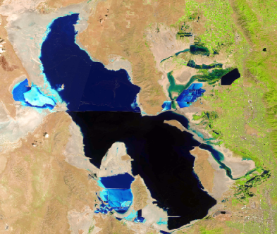
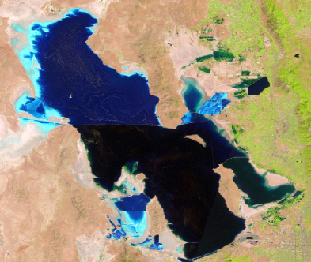

```{r, init}
#setwd('C:\\Users\\jvander\\Documents\\R\\gsldb\\dashboard')
load('sal_db_figs.Rdata') 
```


# Overview map

Row
-----------------------------------------------------------------------
###
```{r}
au_map
```


# Elevation

Row
-----------------------------------------------------------------------
### 
```{r}
sa_elev_gauge
```

### 
```{r}
na_elev_gauge
```


Row
-----------------------------------------------------------------------

### Time series
```{r}
elev_ts
```


# Salinity
Sidebar {.sidebar data-width=300}
-------------------------------------

### Salinity in Great Salt Lake
**Current Gilbert Bay salinity** is characterized by the average of open water Gilbert Bay surface samples in the last 120 days.  
<br>
**Current Gunnison Bay salinity** is the average of measurements from last 120 days at the Gunnison Bay near Saline, UT gauge.
  
All salinity data were downloaded from [USGS NWIS](https://waterdata.usgs.gov/nwis){target="_blank"}. 


Row
-----------------------------------------------------------------------
### 
```{r}
sa_sal_gauge
```

### 
```{r}
na_sal_gauge
```


Row
-----------------------------------------------------------------------

### Time series
```{r}
sal_ts
```


# Nutrients

Row
-----------------------------------------------------------------------

### Gilbert Bay phosphorus time series
```{r}
tp_ts
```


### Gilbert Bay nitrogen time series
```{r}
tn_ts
```

Row
-----------------------------------------------------------------------


### Phosphorus by bay
```{r}
tp_bp
```

### Nitrogen by bay
```{r}
tn_bp
```


# Selenium

Sidebar {.sidebar data-width=300}
-------------------------------------
DWQ has established a numeric criterion for selenium (Se) in bird eggs in Gilbert Bay of 12.5 mg/kg dry weight, and has been monitoring bird egg Se concentrations since 2011. 
All observed nesting season Se geomeans to date have been less than 12.5. Therefore, DWQ has concluded that Gilbert Bay is fully supporting for the class 5A bird egg 
selenium criterion. In addition, all observed seasonal geomeans have been lower than the lowest egg Se concentration trigger identified in R317-2-14 (5.0 mg/kg). 
DWQ will continue to monitor and assess Se concentrations in egg tissue in GSL.

Row
-----------------------------------------------------------------------

### Selenium in bird eggs

```{r, se-eggs}
egg_se_bp
```


# Satellite

Sidebar {.sidebar data-width=300}
-------------------------------------

Satellite imagery of Great Salt Lake in the summer of 2002, at an elevation of about 4,200 ft (approximate long-term average lake elevation) versus 
the summer of 2019 with the lake at an elevation of about 4,192 ft.

Row
-----------------------------------------------------------------------

###
```{r, out.extra='style="border: none;"', out.width='100%', eval=F}
# see: https://github.com/NUKnightLab/juxtapose#html-implementation
knitr::include_url("images/slider.html", height="100%")
```

<div id="juxtapose-wrapper" class="juxtapose" data-startingposition="20%" style="width: 600px">
<div class="juxtapose">
   
   
</div>
<script src="https://cdn.knightlab.com/libs/juxtapose/latest/js/juxtapose.min.js"></script>
<link rel="stylesheet" href="https://cdn.knightlab.com/libs/juxtapose/latest/css/juxtapose.css">


<style>
body:after {
content: url(www/deq_dwq_logo.png);
position: fixed;
bottom: 0.5em;
left: 0.5em;
}
</style>


