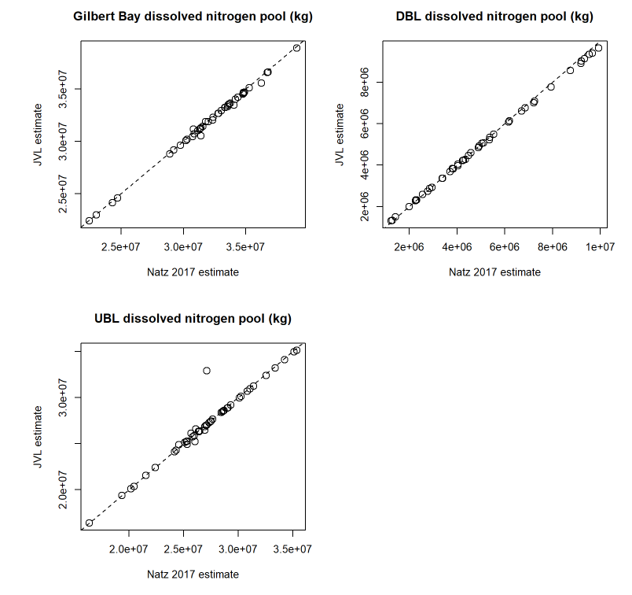

# Documents
bookdown.org/jakevl/gsldb-analyses  
udwq.shinyapps.io/gsl_salt_pools  
bookdown.org/jakevl/gsldb  


# Introduction
This analysis uses the approach from Naftz (2017) to calculate Gilbert Bay deep brine layer (DBL) & upper brine layer (UBL) volumes and constituent masses to estimate salt masses within Gilbert Bay by brine layer.  
  
All data are all from USGS NWIS.

# Objectives

1. Estimate Gilbert Bay brine layer salt pools
2. Replicate the Naftz (2017) nitrogent pool estimates
3. Automate the pool estimate process to allow rapid updates and application to other constituents

# General methods
To estimate salt pools:

1. Estimate monthly UBL and DBL volumes
2. Estimate monthly average brine layer salinities
3. Multiply volumes by salinities to estimate masses

# General methods
There are two main differences between this analysis and the Naftz approach:  
1. I incorporated all available data from all sites in Gilbert Bay in addition to the four monitoring locations used in Naftz (2017).  
2. I did not fill missing data by month and site with the previous observed value. Any month with no salinity results available for a brine layer will produce an NA result.

# Brine layer volume estimates
- Monthly UBL and DBL volumes were estimated daily Gilbert Bay elevations
- Elevation to DBL elevation and DBL elevation to DBL volume relationships (Naftz 2017 &  Baskin 2005).
- These relationships were based on observations from 2010-2014; Gilbert Bay elevations 1278-1279 m (~4193-4196 ft). 
- DBL volumes are estimated for north and south DBL basins separately

# Brine layer salinity estimates
- Salinities calculated from density via equation of state (Naftz et al. 2011)
- Assigned samples to brine layer by site location and depth ([see map](./site_map.html){target="_blank"})
	+ DBL: sites 2601 & 3510; sample depth >= 5 m
	+ UBL: all other GB sites; sample depth <= 2 m
- Monthly average salinities in each brine layer

# Mass calculations
- Multiply monthly brine layer volumes by monthly average salinities
- North and south DBL basin masses summed to simplify plots

# Validation
- Compared results for filtered nitrogen
- Strong agreement between the two methods.  

# Validation
```{r, jvl-naftz-comp1, echo=F, out.width = "60%", fig.align="center"}

```

# Validation
```{r, jvl-naftz-comp2, echo=F, out.height = "90%", fig.align="center"}
knitr::include_url("images/jvn_naftz_dn_comp2.html")
```

# Results
```{r, salt-mass-plot2, echo=F, message=F, out.width = "80%", fig.align="center"}
options(warn=-1)
salt_mass_plot
#crosstalk::bscols(widths=6, salt_mass_plot, elev_ts, sal_ts, site_map)
```

# Results
- Total salt pool was stable prior to breach opening
- About 20% of the salt pool accounted for in the DBL
- DBL salt pool mixed into the UBL pool when culverts were closed (Aug 2014 - Dec 2016)
- Gilbert Bay salt decreased following the opening of the causeway breach.  
- Although DBL currently exists in Gilbert Bay, the mass of salt in the DBL is small due to small volume
- Recent lake levels are at the very bottom of the WSE:DBL volume relationship

# Discussion

- Expand the WSE:DBL elevation and volume relationships
- Characterize error & sampling variability
- Consistency with other salt budget components
- DBL mass estimate gaps resulting from densities exceeding equation of state calibration
- Consider appropriate platforms for communicating, documenting, and integrating SAC analyses ([one option](./gsldb.html){target="_blank"})


<style>
.reveal p {
  text-align: left;
}
.reveal ul {
  display: block;
}
.reveal ol {
  display: block;
}  
.reveal section img { background:none; border:none; box-shadow:none; }
.slide {
    height: 700px;
    overflow-y: auto !important;
}
body:after {
content: url(images/dwq_logo_small.png);
position: fixed;
bottom: 3.5em;
left: 3.5em;
}
</style>
